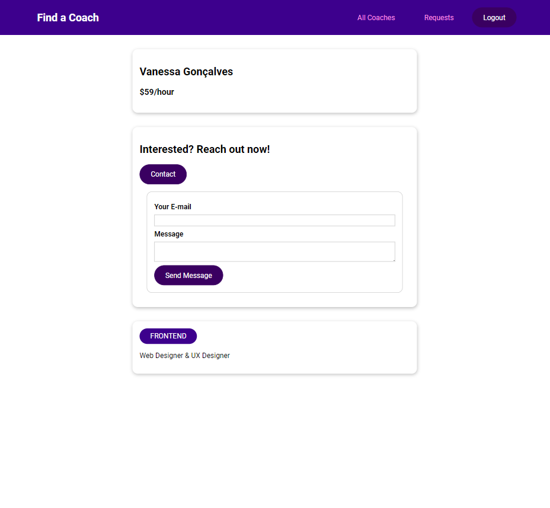
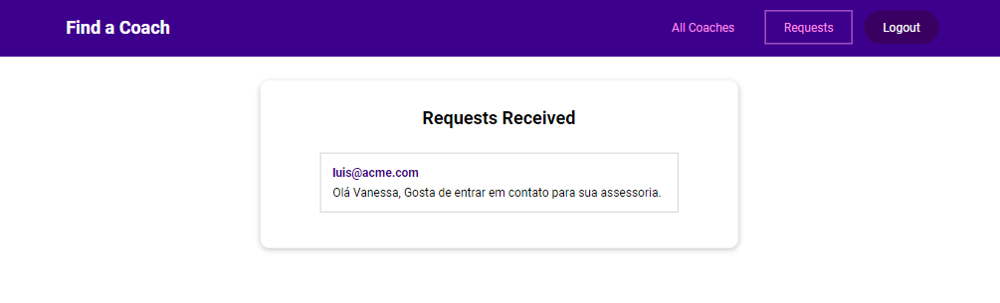
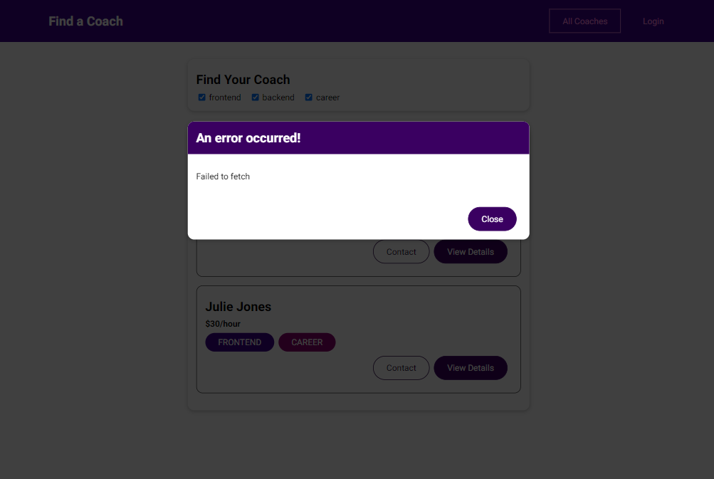

<h1 align="center">Find a Coach</h1>

  

  

  

  

## 🚀 Tecnologias

Esse projeto foi desenvolvido com as seguintes tecnologias:

- HTML
- CSS
- JavaScript
- VueJS
- Firebase

## 💻 Projeto

App simples para se registar e buscar coaches nas ares de Frontend, Backend e Career.
Apenas um projeto simples para aplicar o conhecimento adquirido de VueJS, Vuex, autenticação e login com Firebase.

---

Feito com ♥ by Cleber-Risu
